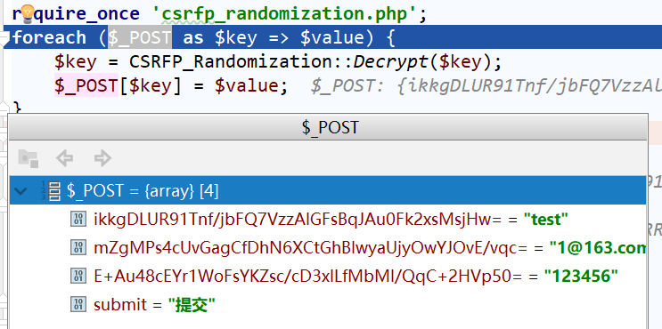
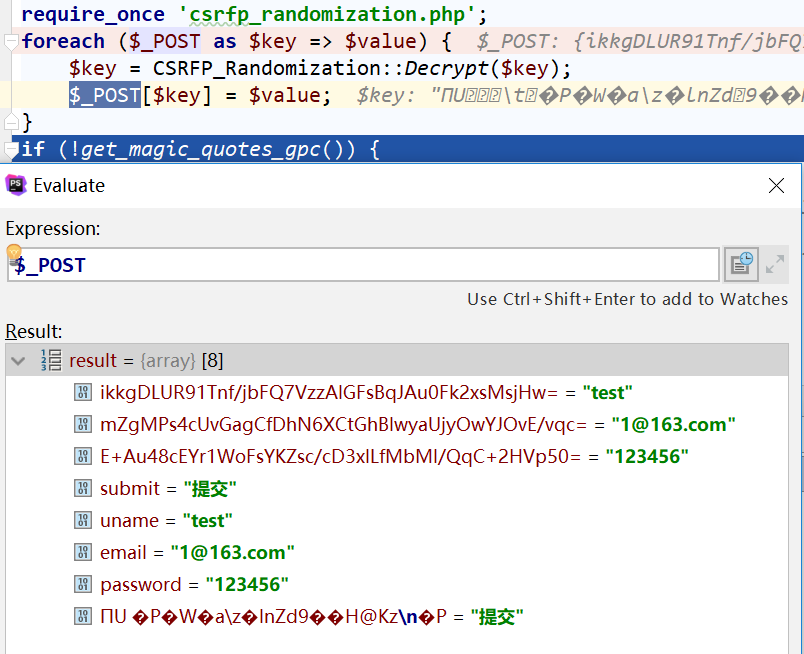

## 项目说明
CSRF-Protection，是一个对请求参数中的参数名进行随机化的php库，开发者可以利用此库方便对参数名进行随机化。为了方便开发者使用，开发者可以选择手动地调用`csrfp_randomization.php`完成对php代码的随机化。

## 使用说明
一般情况下都会引入功能库
假设输出页面存在如下的代码：
`common.php`
```PHP
if (!get_magic_quotes_gpc()) {
    if (isset($_REQUEST)) {
        $_REQUEST = addsl($_REQUEST);
    }
    $_COOKIE = addsl($_COOKIE);
    $_POST = addsl($_POST);
    $_GET = addsl($_GET);
}
function addsl($value) {
    if (empty($value)) {
        return $value;
    } else {
        return is_array($value) ? array_map('addsl', $value) : addslashes($value);
    }
}
```
`index.php`
```PHP
<?php require 'common.php';?>
<body>
    <form action="login.php" method="post">
        用户名:<input name="uname" type="text"/> <br/>
        邮箱:<input name="email" type="text" />  <br/>
        密码：<input name="password" type="password"> <br/>
        <input type="submit"name="submit" value="提交">
    </form>
</body>
```
上述就是在一般php程序中的使用方法，一般的文件都会应用一些公共文件，如`common.php`，而`common.php`一般也会封装一些常见的函数功能，包括过滤或者是字符串格式化等方法。

我们采用的随机化方法如下：
在`common.php`中引入我们的随机化的类
```PHP
foreach ($_POST as $key => $value) {
    $_POST[$key] = CSRFP_Randomization::Decrypt($value);
}
if (!get_magic_quotes_gpc()) {
    if (isset($_REQUEST)) {
        $_REQUEST = addsl($_REQUEST);
    }
    $_COOKIE = addsl($_COOKIE);
    $_POST = addsl($_POST);
    $_GET = addsl($_GET);
}
function addsl($value) {
    if (empty($value)) {
        return $value;
    } else {
        return is_array($value) ? array_map('addsl', $value) : addslashes($value);
    }
}
```
这样凡是引入了`common.php`的文件都会引入我们的`csrfp_randomization.php`，方便我们进行之后的随机化操作。同时通过`$_POST[$key] = CSRFP_Randomization::Decrypt($value)`进行去随机化的操作，之后进行正常的流程。

对应的`login.php`的随机化方法如下：
```PHP
<body>
    <form action="login.php" method="post">
        用户名:<input name="<?php echo CSRFP_Randomization::Encrypt('uname')?>" type="text"/> <br/>
        邮箱:<input name="<?php echo CSRFP_Randomization::Encrypt('email')?>" type="text" />  <br/>
        密码：<input name="<?php echo CSRFP_Randomization::Encrypt('password')?>" type="password"> <br/>
        <input type="submit"name="submit" value="提交">
    </form>
</body>
```

那么最后经过随机化之后的页面内容是
```html
<form action="login.php" method="post">
    用户名:<input name="ikkgDLUR91Tnf/jbFQ7VzzAlGFsBqJAu0Fk2xsMsjHw=" type="text"/> <br/>
    邮箱:<input name="mZgMPs4cUvGagCfDhN6XCtGhBlwyaUjyOwYJOvE/vqc=" type="text" />  <br/>
    密码：<input name="E+Au48cEYr1WoFsYKZsc/cD3xlLfMbMI/QqC+2HVp50=" type="password"> <br/>
    <input type="submit"name="submit" value="提交">
</form>
```

当用户提交参数之后，服务器接受到的都是随机化之后的参数名，如下：



经过正确的解密之后，得到结果如下：



这样后续的操作就可以进行。但是如果解密失败，那么后面的逻辑均无法处理，通过这种方式就能够有效地防御CSRF攻击。

## 总结
以上简单的演示了如何使用随机化的方法来防御CSRF攻击。如果对这个方法雨哦任何的疑问，欢迎通过邮箱whucs303@126.com或者是issue的方式联系。